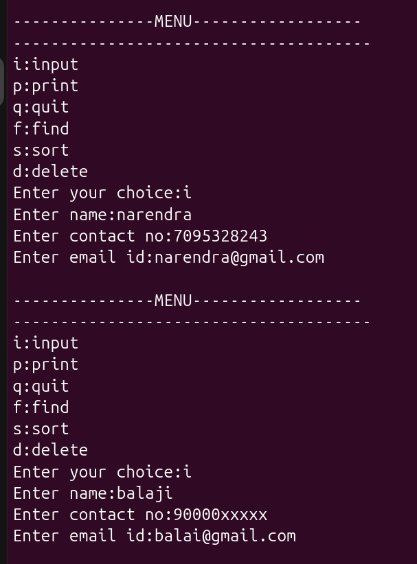
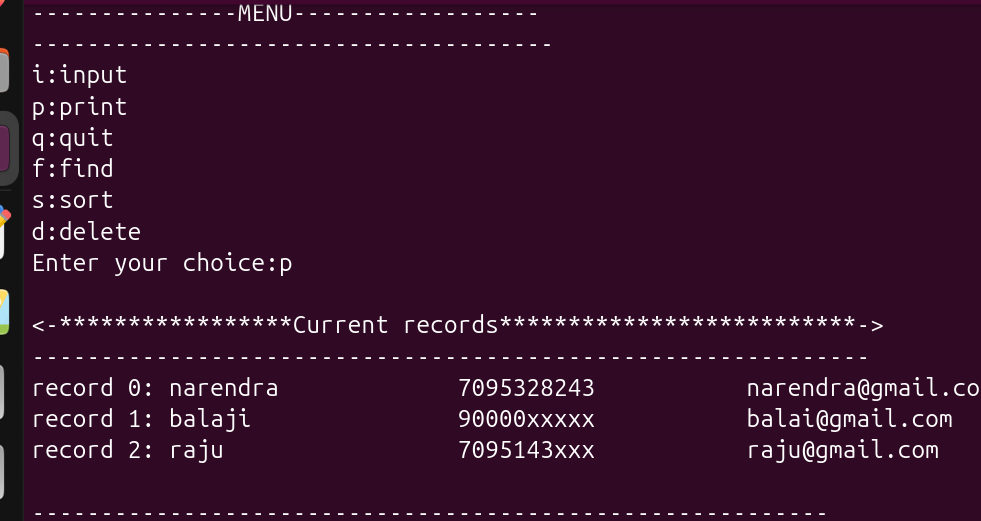
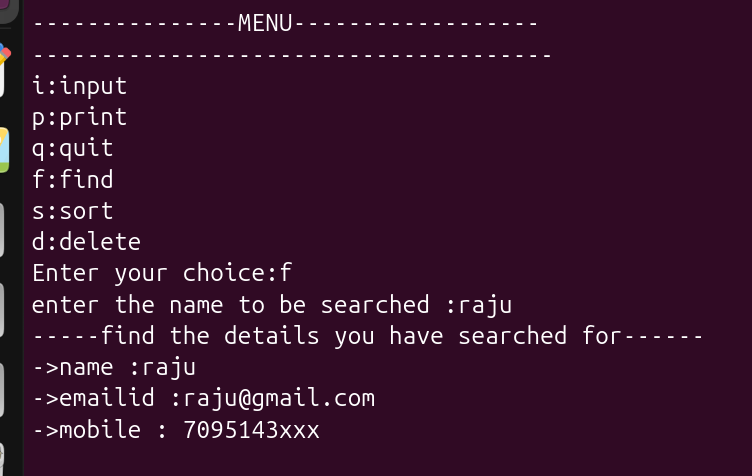

# Dynamic Contact Management System

A menu-driven **C programming project** for managing contact records
using structures, pointers, dynamic memory allocation, strings,
searching, sorting, and record deletion.

## Project Overview

This project stores contact information dynamically. Each contact
contains:

-   Name
-   Contact Number
-   Email ID

The contact database grows dynamically whenever a new record is added.

## Features

-   **Input / Add Contact** -- Add a new contact to the database.
-   **Print Records** -- Display all stored contacts.
-   **Find Contact** -- Search for a contact by name.
-   **Sort Contacts** -- Sort contacts alphabetically by name using
    Bubble Sort.
-   **Delete Contact** -- Delete a record by its index and resize the
    database.
-   **Quit** -- Exit the application.

## C Concepts Used

-   Structures
-   Pointers
-   Dynamic Memory Allocation (`malloc()`, `realloc()`)
-   String handling (`strlen()`, `strcpy()`, `strcmp()`)
-   `memmove()`
-   Bubble Sort
-   Modular programming using `.c` and `.h` files
-   Menu-driven programming

## Project Structure

``` text
Dynamic-Contact-Management-System/
│
├── main.c
├── contact.c
├── contact.h
└── README.md
```

### `main.c`

Contains the `main()` function, menu, and program control flow.

### `contact.c`

Contains the implementations of contact operations:

-   Input
-   Print
-   Find
-   Sort
-   Delete

### `contact.h`

Contains the `CONTACT` structure, `extern` declaration, and function
prototypes.

## Contact Structure

``` c
struct CONTACT
{
    char *name;
    char *contactNo;
    char *emailId;
};
```

The strings are dynamically allocated according to the input length.

## Menu

``` text
---------------MENU------------------
--------------------------------------
i: input
p: print
q: quit
f: find
s: sort
d: delete
Enter your choice:
```
## Screenshots

### Add Contact



### Print Records



### Find Contact



### Sort Contacts


### Delete Contact


This project is written for a GCC/Linux environment.

Compile both source files together:

``` bash
gcc main.c contact.c -o contact
```

Run the program:

``` bash
./contact
```

## Example

Sample records:

``` text
Index    Name       Contact No       Email
0        narendra   7095328243       narendra@gmail.com
1        balaji     90000xxxxx       balaji@gmail.com
2        raju       7095143xxx       raju@gmail.com
```

## Learning Outcome

This project provided practical experience with **structures, pointers,
dynamic memory allocation, string manipulation, searching, sorting, and
modular C programming**.

It was developed as part of hands-on **C / Embedded C programming
practice**.

## Author

**Narendra**

------------------------------------------------------------------------

### Build • Learn • Practice C
